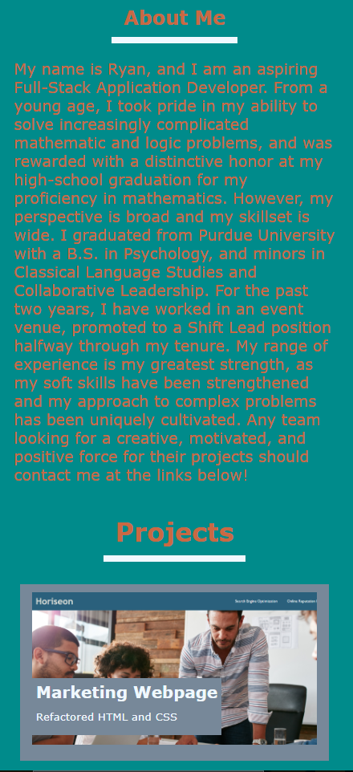

# Ryan Sauter's Programming Portfolio

## Description

In order to practice my front-end development technical skills, as well as set up my future success as a developer, I created a website portfolio! This was an exercise in flexbox CSS styling as well as Mobile-First Development. This will help me showcase myself and all of the future projects I will create in one, easily accessible package, so employers will be able to point to deployed projects of mine. Creating something from scratch was daunting, but not only did this reinforce my use of semantic HTML elements due to its potentially confusing structure, but also this helped me nail down the process for spacing and styling a webpage, because that begins in the mockup and ideation stages. Overall, I'm very pleased with how this came out.

## Installation

N/A

## Usage

This landing page contains at the top a standard navigation bar and a picture that captures an atmosphere that embodies me, as it is an introduction to me. The main functionality comes in its directory and catalog of applications. Designed for quickly finding all the important information that employers may need, the bar will direct their attention where it needs to be. The catalog is designed to display one cornerstone project as well as others to supplement what the employers may need to know. This was also designed to be easily accessible and readible on mobile, see the screenshots below.

## Credits

N/A